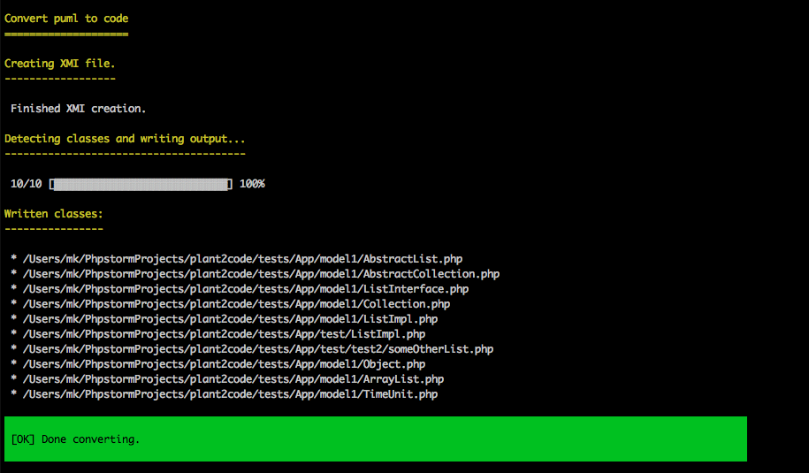
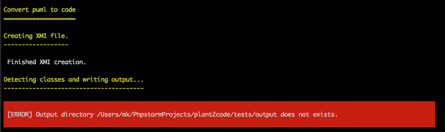

# Plant2Code

Plant2Code can be used to generate (currently only PHP) classes from your [plantuml](http://plantuml.com/class-diagram) class diagramm. 
It converts the plantuml class diagramm into XMI and creates the target language class files based on the XMI declarations.

## Requirements

* current Java RE (on Mac the JDK is required) - don't know about Windows systems, I didn't and will not test there. 
* PHP >= 7.x
* [Composer](https://getcomposer.org) 

## Installation

### Global

Install:
```
$ composer global require mk-conn/plant2code
```

Update:
```
$ composer global update mk-conn/plant2code
```

### Somewhere in a folder of your choise 

Clone or download this repository. Run `composer install --no-dev` from the root directory (omit the --no-dev option, if you intend 
to develop in this project). Done.

### Within a project
In your composer.json:

```
"require": {
    ...
    "mk-conn/plant2code": "^v1.0.0"
  },
```
## Running

### From global
```
$ plant2code puml:convert path/to/input.puml --output="path/to/output/dir" [--lang="php"] [--root-ns="SomeNamespace"]
```

* **--output** Optional output directory (must exists) where classes are written to. Defaults to the folder where 
the *.puml input files is stored.
* **--lang**: Optional target language - defaults to PHP
* **--root-ns**: Optional root namespace - this will be prepend to the detected namespaces

### From project directoy

```
path/to/plant2code $ bin/plant2code puml:convert path/to/input.puml --output="path/to/output/dir" [--lang="php"] [--root-ns="SomeNamespace"]
```

## Output

Success:



Failure:




## Tips

Although it is possible to write class properties and methods like this in plantuml:
```
class Test {
    string #name // or #string name
}
```
the required syntax for plant2code to work correctly is:
```
class Test {
    #name : string
    
    +update(arg1 : int, arg2 string)
}
```

## Features not yet implemented
* option to format code output
* more languages (Java, Ruby, JavaScript)

## Thanks

Thanks goes out to the plantuml developers who let me use the binary **plantuml.jar** which is distributed under LGPL.
And another big thanks to the developers who implemented my suggestions and wishes in no time very quick!
